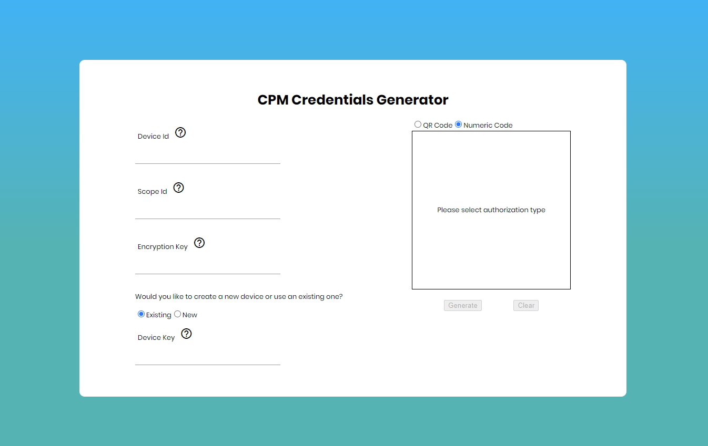
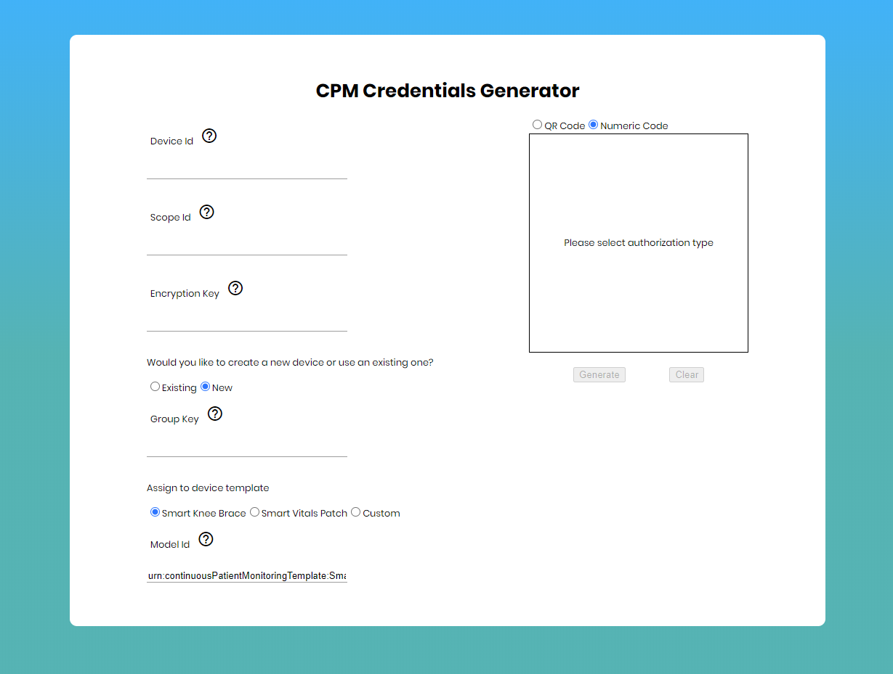
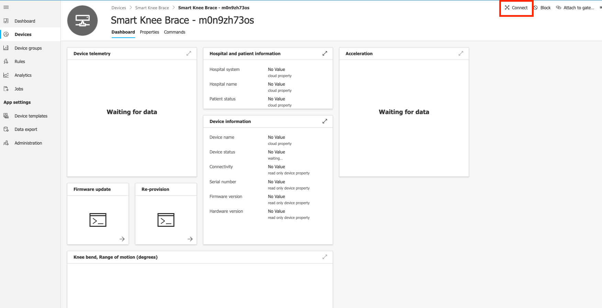
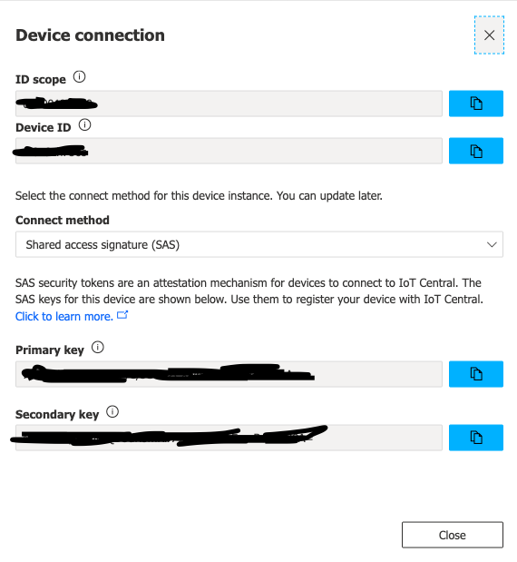
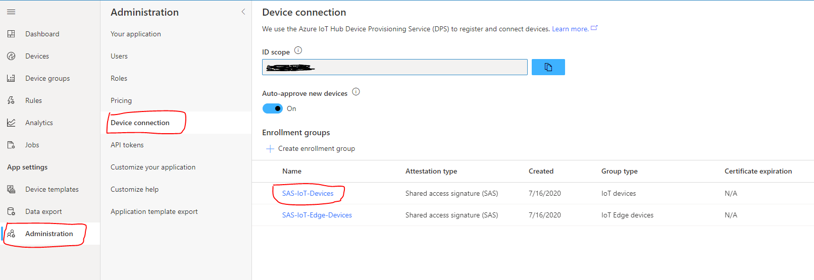
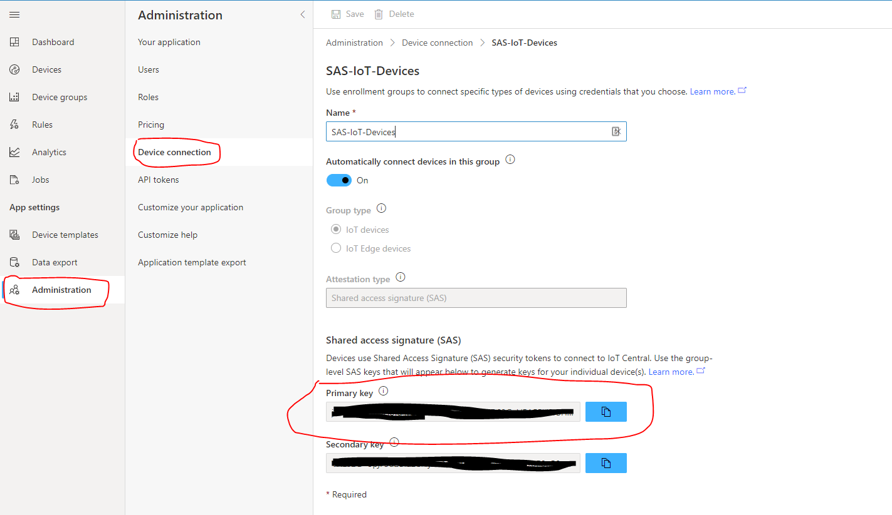
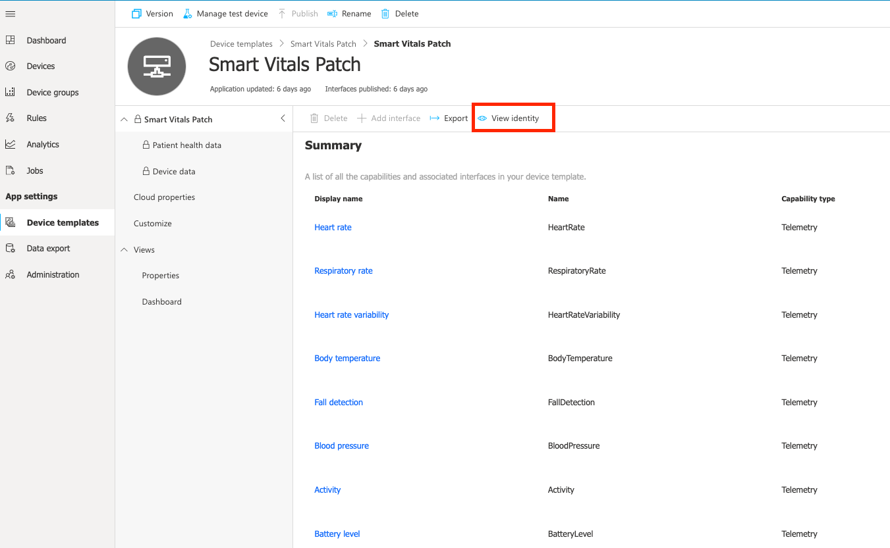
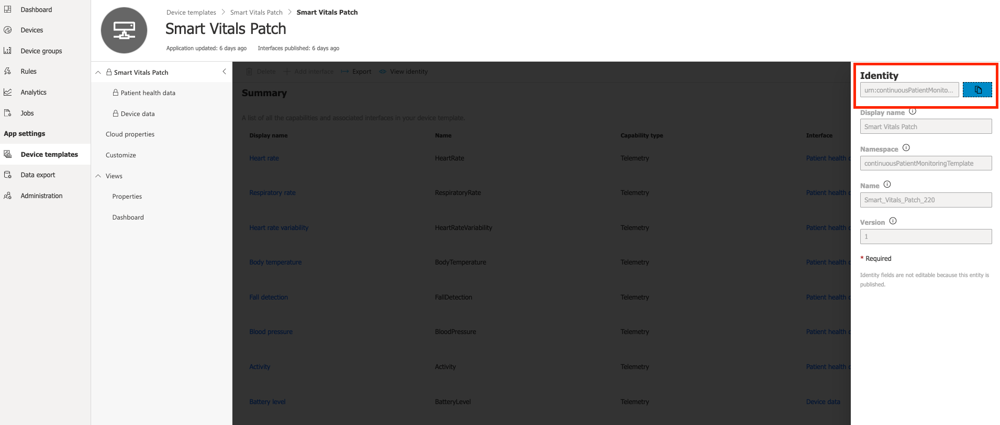

# Credentials Generation

In order to send telemetry to Azure IoT Central, the application needs to be authorized as an IoT Central device.
Authorization can be via QR code or numeric code.

The credentials portal at [cpm-cred-server.azurewebsites.net](https://cpm-cred-server.azurewebsites.net) helps generating authorization codes.
The source code for the website is available under the _creds-generator_ folder as a reference.




Required fields are:
- __Device Id__: the unique id of the device inside the application. If creating a new device this will also be used as display name that can be changed from inside the Central site.
- __Id Scope__: unique Id of the IoT Central application used by the Device Provisioning Service (DPS)
- __Encryption key__: passphrase for encrypting generated credentials. This is the same value of user's password used inside the mobile application at login. Encryption key is mandatory to secure credentials transmission to the mobile app.
- __Device Key__: Symmetric primary key to use when authenticating device to IoT Central.

For new devices:
- __Group Key__: Symmetric primary key of the application to use when generating device specific keys.
- __Model Id__: The newly created device will be assigned to the device template with the id specified here.


## Retrieve Ids
For existing devices, connection details are accessible through the "Connect" tab under device view.




For new devices, these are available from the "Administration" page under the "Device Connection" section. Make sure "Auto approve" is enabled and open available enrollment of type "Shared access signature (SAS)".


The group type must be "IoT devices", edge devices are not currently supported. If not, open a different enrollment from the list in previous screen until found a vald one or create a new one for devices.



## Retrieve IoT Central device template Id

Device template id (a.k.a Model Id) is used by credentials generator to obtain authorization codes for new devices and automatically assign them to the right template.
By providing template id during credentials generation, user doesn't need to manually migrate or assign device from IoT Central site.

In order to get the unique identifier, open configuration page for required model under "Device templates" section.



Click on "View Identity" and in next screen copy model urn.



## Run custom credentials generator site
Source code of the sample credentials generator web site is available in the [creds-generator](../creds-generator) folder.
You can take it as an example and create your own web site or just deploy it as is.
When deploying current sample site, make sure host supports **Node.JS 10+**.

### Build and run
```shell
npm install # automatically build project
npm run start
```
Other commands are available to ease local debug (_npm run \[cmd\]_)

-   **live-server**: runs a local web server
-   **watch:client**: compiles typescript client code in watch mode
-   **watch:server**: compiles typescript server code in watch mode
-   **build**: compiles both client and server code