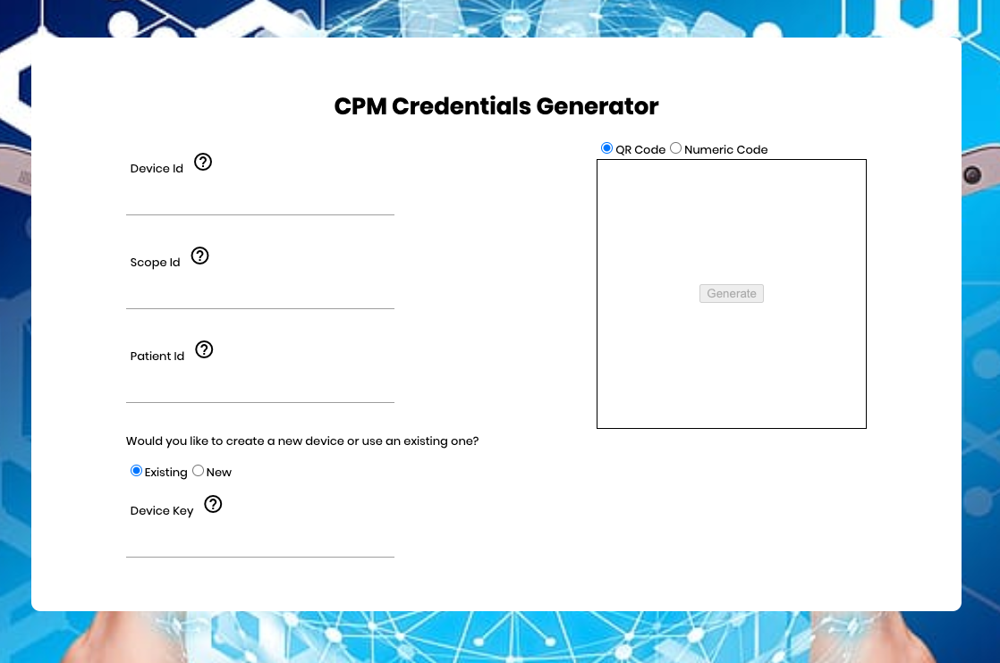
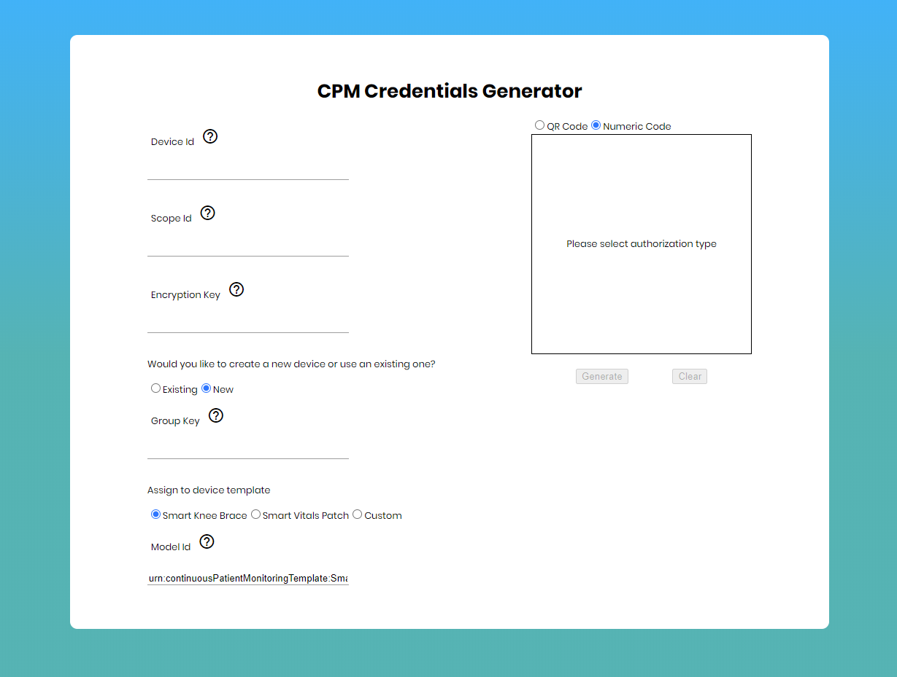
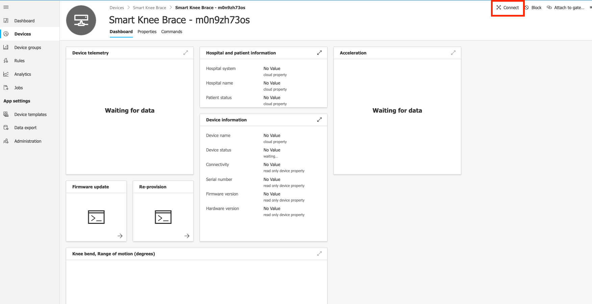
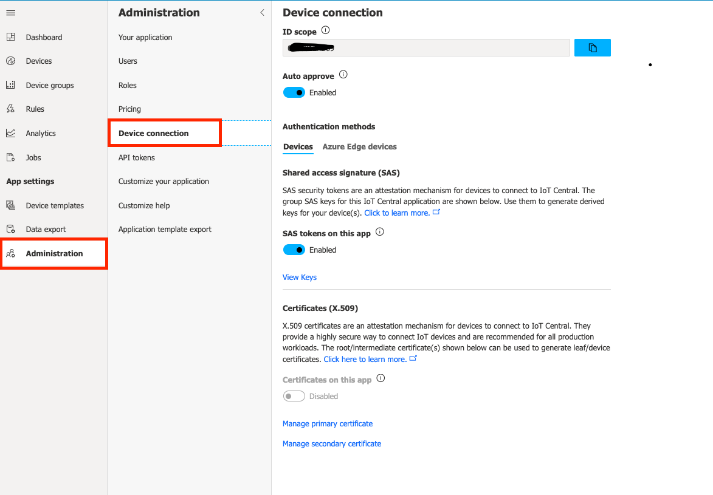

# Credentials Generation

In order to send telemetry to Azure IoT Central, the application needs to be authorized as a Central device.
Authorization can be via QR code or numeric code.

The credentials portal at [cpm-cred-server.azurewebsites.net](https://cpm-cred-server.azurewebsites.net) helps generating authorization codes.
The source code for the website is available under the _creds-generator_ folder as a reference.

Required fields are:
- __Device Id__: the unique id of the device inside the application. If creating a new device this will also be used as display name that can be changed from inside the Central site.
- __Scope Id__: unique id of the IoT Central application inside provisioning service
- __Encryption key__: passphrase for encrypting generated credentials. This is the same value of user login password used inside the mobile application. Encryption key is mandatory to secure credentials transmission to the mobile app.
- __Device Key__: Symmetric primary key to use when authenticating device to IoT Central.

For new devices:
- __Group Key__: Symmetric primary key of the application to use when generating device specific keys.
- __Model Id__: The newly created device will be assigned to the device template with the id specified here.

## Retrieve Ids
For existing devices, connection details are accessible through the "Connect" tab under device view.

For new devices, these are available from the "Administration" page under the "Device Connection" section. Make sure "Auto approve" and "SAS tokens" are available and click on "View Keys" to show the Group enrollment primary key.

## Retrieve IoT Central device template Id

Device template id (a.k.a Model Id) is used by credentials generator to obtain authorization codes for new devices and automatically assign them to the right template.
By providing template id during credentials generation, user doesn't need to manually migrate or assign device from IoT Central site.

In order to get the unique identifier, open configuration page for required model under "Device templates" section.

Click on "View Identity" and in next screen copy model urn.

