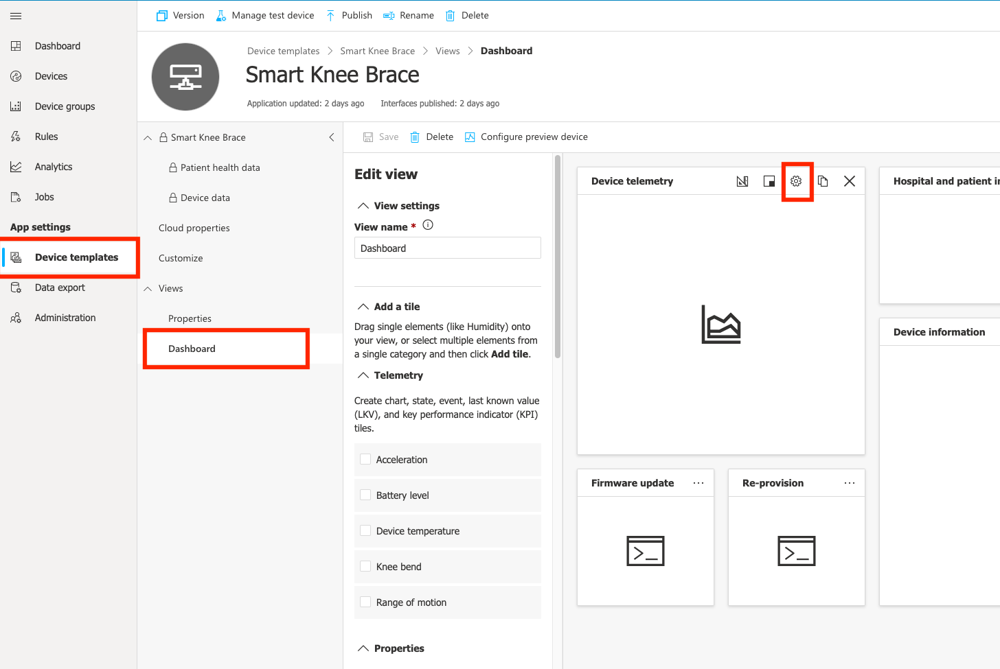
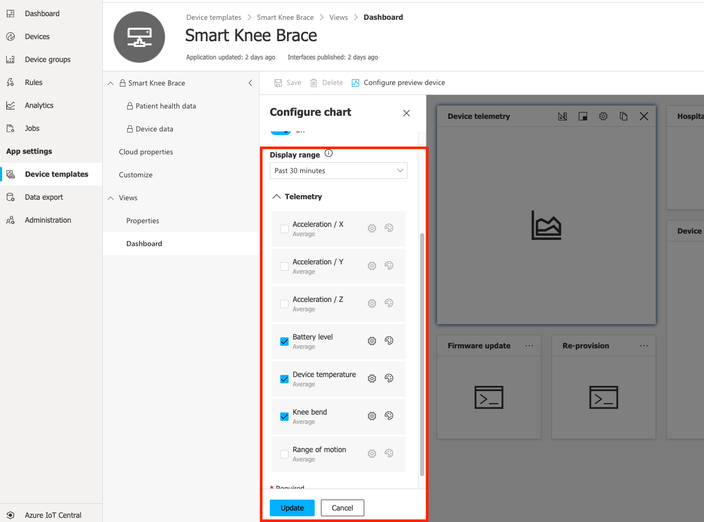
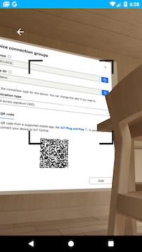
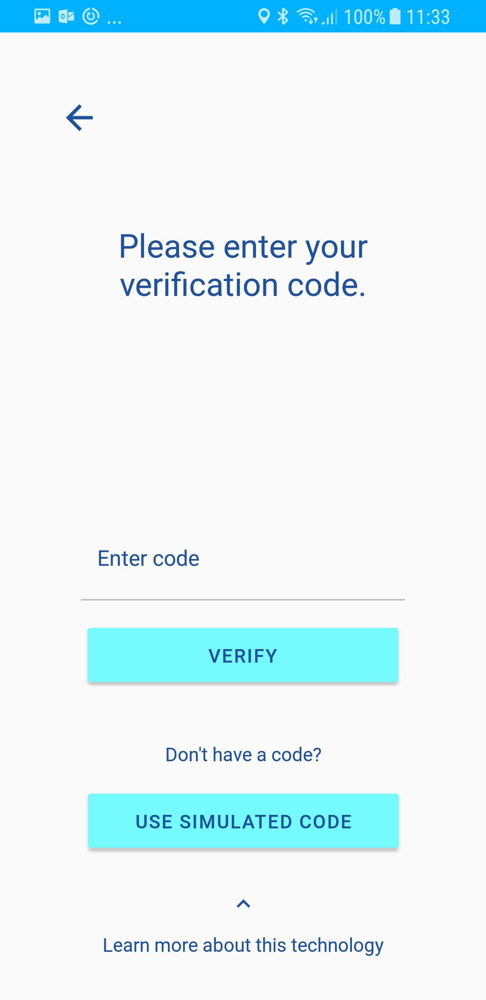

# Simulation
This application comes with a simulation feature that allows a complete experience without a physical BLE device or a real connection to IoT Central. Due to their limitations, this is a good option when testing on Android or iOS simulators.

## Simulate BLE device
Two types of simulated devices are available in the application: "Smart Knee Brace" and "Smart Vitals Patch". This models reflect default models in the Azure IoT Central CPM application template (read more on Continuous Patient Monitoring [here](https://docs.microsoft.com/en-gb/azure/iot-central/healthcare/overview-iot-central-healthcare#what-is-continuous-patient-monitoring-template)).

Both Knee Brace and Vitals Patch simulated devices send out all available telemetry items, however the CPM application template only shows some of them by default (Device Temperature and Battery Level).
You can enable/disable items to be shown in IoT Central from the "Device templates" tab.

Either add/remove items from the available tile as shown above or create new tiles.
More details available in [official documentation.](https://docs.microsoft.com/en-gb/azure/iot-central/core/howto-set-up-template).

### Limitations
The current version of the application doesn't support device re-mapping after switching between different simulated device models.
This means that if a simulated device has been associated through credentials with a device in IoT Central and the user goes back selecting another simulated device of different type, a new device will not be created in IoT Central and data will not be available.
We suggest you restart the application and generate new credentials to create/associate a different device in IoT Central.

Possible scenarios:
- Different templates (not working):
    1. User generates credentials for a "Smart Knee Brace" device in Central.
    2. User selects a "Smart Knee Brace" device in the mobile application.
    3. Data starts flowing.
    4. User goes back and selects a simulated "Smart Vitals Patch" device in the mobile application.
    5. Data does not show in IoT Central (besides Device Temperature and Battery Level)
- Same template (working):
    1. User generates credentials for a "Smart Knee Brace" device in Central.
    2. User selects a "Smart Knee Brace" device in the mobile application.
    3. Data starts flowing.
    4. User goes back and selects another simulated "Smart Knee Brace" device in the mobile application.
    5. Data shows in IoT Central in the same device

## Simulate IoT Central connection
If you don't have an IoT Central application, network is not available or simply want to see data in mobile application but not sending any telemetry out, you can skip connection to IoT Central by selecting "Use simulated code" in either QR code or numeric code screens.

Since mobile application is not connected to any device in IoT Central, you can change device at any time during application run.

