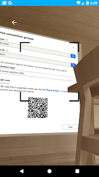
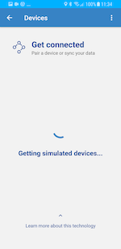

# Walkthrough

## 1. Authorization

Scan QR Code to connect to a device in IoT Central. 

To skip this, tap on "Use simulation". The application will still read data from BLE devices or health providers and show it on insight chart but it will not generate telemetry data for IoT Central.

## 3. Home

Select one of the options.
- __Pair device__: allows to connect to a real or simulated BLE device.
- __Sync with platform__: allows to read data from health platforms (Apple Health when running on iOS, Google Fit when on Android).

## 4. Scan devices

Scans for nearby devices. By selecting "Use simulated device" you can skip connecting a real device and use one of the simulated ones which generates sample data every 5 seconds. Simulated devices are mapped to models in the CPM application template (see [docs](https://docs.microsoft.com/en-us/azure/iot-central/healthcare/tutorial-continuous-patient-monitoring)).

## 5. Insight

Data from BLE device or platforms are shown in the chart. Legend is at bottom.
Detail message is hardcoded. The developer can change that text accordingly to read data.

More details at [Insight.](./insight.md)